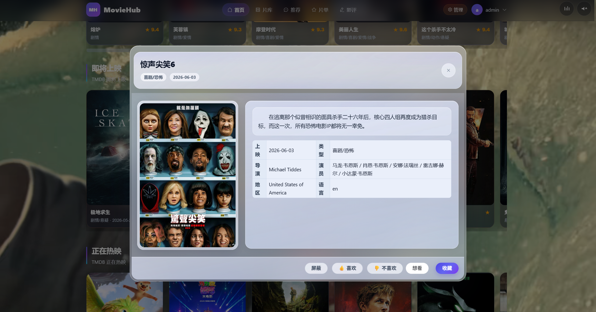
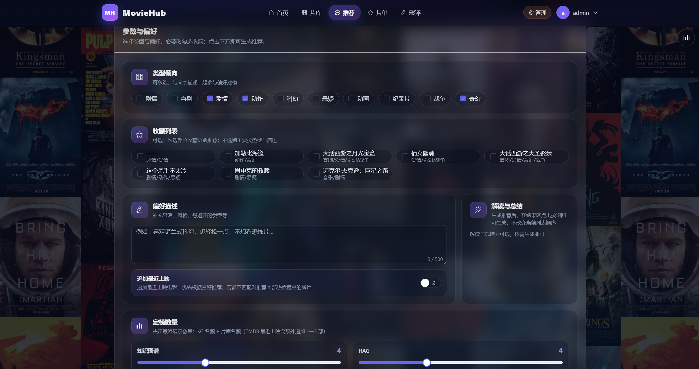
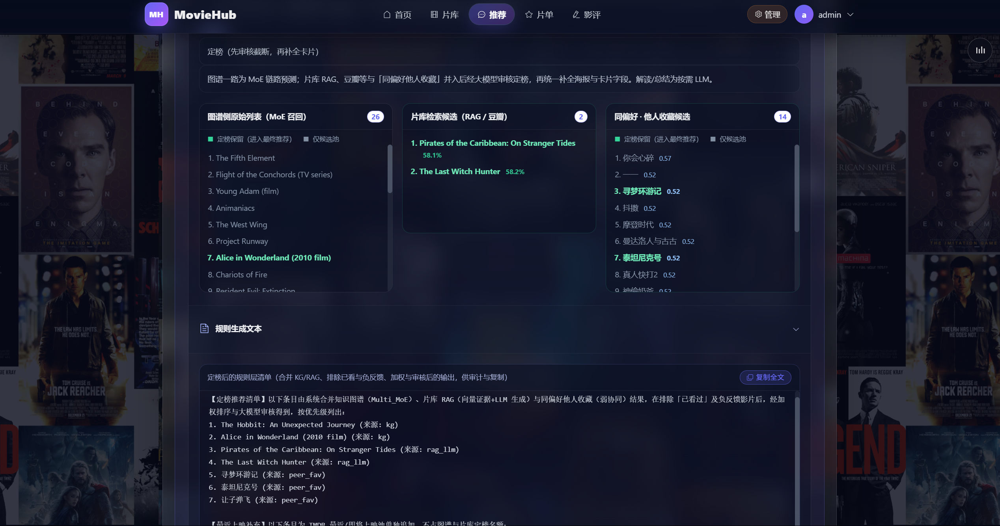
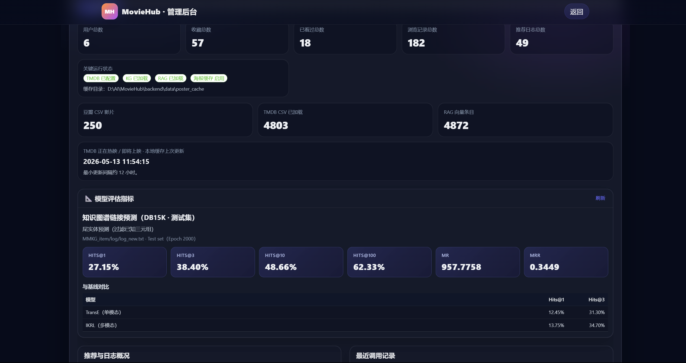
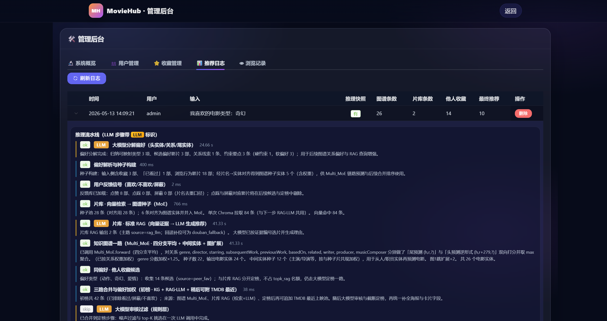
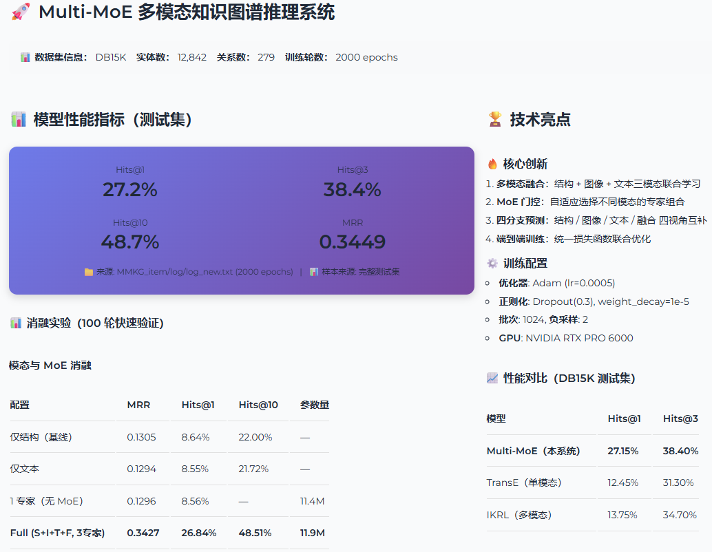
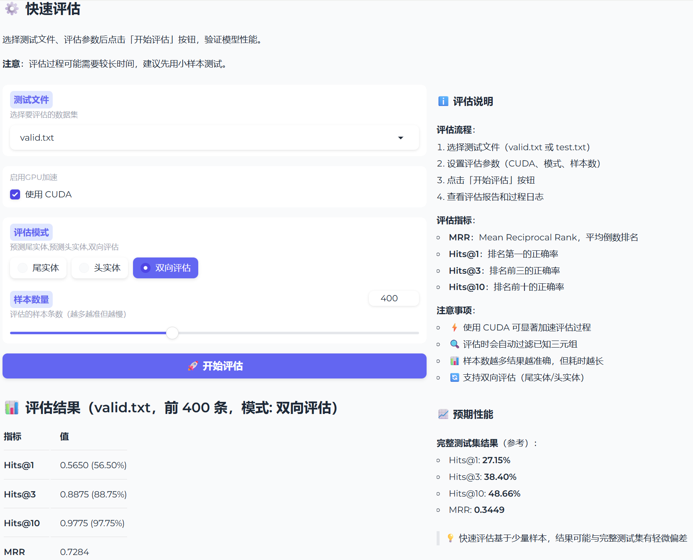
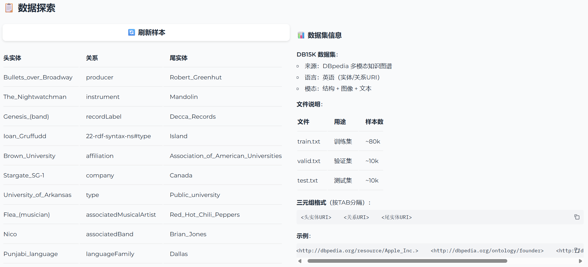
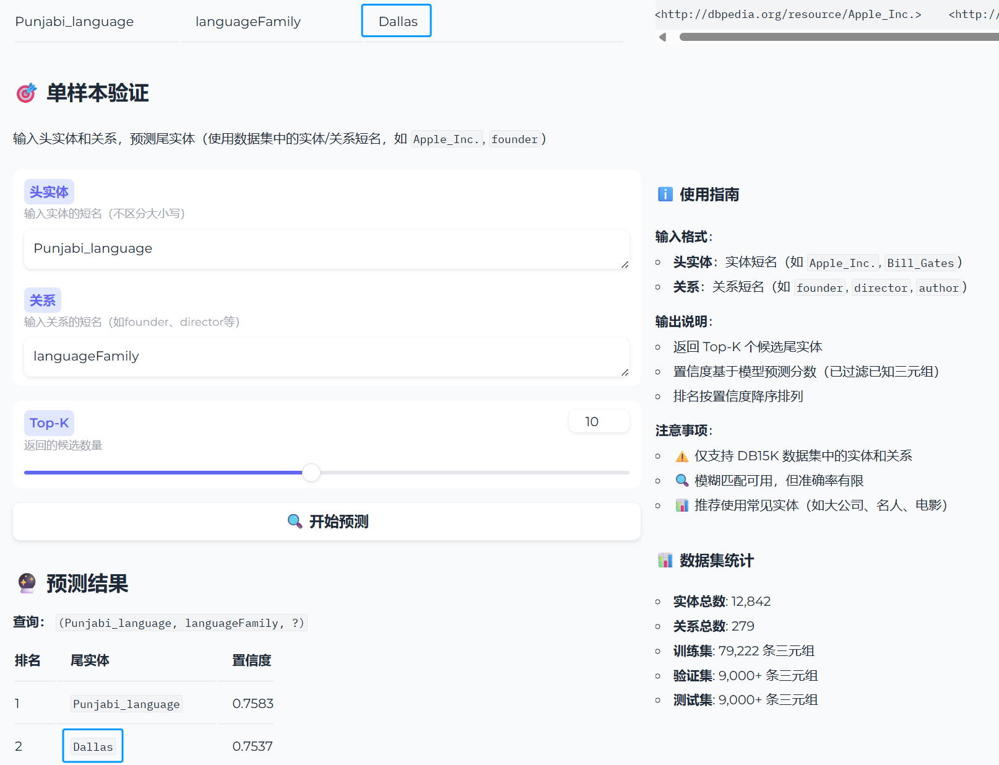

# MovieHub

基于 **知识图谱预测 + RAG 语义检索** 的电影推荐系统。


## 技术栈

| 层级 | 技术 |
|------|------|
| 前端 | Vue 3 + TypeScript + Element Plus + Pinia + Axios |
| 后端 | FastAPI + MySQL + ChromaDB + Redis（可选） |
| 推荐引擎 | Multi-MoE 多模态知识图谱模型 + RAG 向量检索 + TMDB 新鲜池 |
| 模型训练 | PyTorch + Gradio 演示界面 |
| 数据集 | DB15K（12,842 实体 / 279 关系，结构 + 图像 + 文本三模态） |

## 项目结构

```
MovieHub/
├── backend/                        # FastAPI 后端
│   ├── main.py                     # 应用入口
│   ├── db/database.py              # MySQL 数据访问层
│   ├── api/
│   │   ├── deps.py                 # 认证/鉴权
│   │   └── routers/                # 路由（auth/movies/recommend/reviews/user/admin/home/poster）
│   ├── recommender/                # 推荐引擎（KG 链接预测 + RAG 检索 + LLM 定榜）
│   ├── services/                   # 业务服务（TMDB / 海报缓存）
│   ├── schemas/                    # Pydantic 数据模型
│   ├── eval/                       # 推荐系统离线评估
│   ├── scripts/                    # 工具脚本（RAG 构建 / 别名生成）
│   └── data/                       # 运行时数据（海报缓存 / RAG 向量库 / 配置）
├── frontend/movie-app/             # Vue 3 前端
│   └── src/
│       ├── views/                  # 页面组件
│       ├── components/             # 通用组件
│       ├── stores/                 # Pinia 状态管理
│       ├── services/               # API 调用层
│       └── composables/            # 组合式函数
├── MMKG_item/                      # Multi-MoE 知识图谱模型
│   ├── models/                     # 模型定义（Multi_MoE / MoE 门控）
│   ├── layers/                     # 网络层（ConvE / Fusion）
│   ├── utils/                      # 数据加载与工具
│   ├── train.py                    # 训练脚本
│   ├── eval/                       # Gradio 演示界面
│   ├── ablation/                   # 消融实验
│   ├── datasets/DB15K/             # 数据集
│   └── checkpoint/                 # 训练好的模型权重
└── checkpoint/                     # 消融实验模型权重
```

## 快速开始

### 环境准备

```bash
# Python 依赖
pip install -r requirements.txt

# 前端依赖
cd frontend/movie-app && npm install
```

### 配置环境变量

在项目根目录创建 `.env`：

```bash
# 必填：MySQL
MYSQL_HOST=localhost
MYSQL_PORT=3306
MYSQL_USER=root
MYSQL_PASSWORD=your_password
MYSQL_DATABASE=moviehub

# 可选：大模型（推荐解释 / 偏好分解，未配置自动降级）
DASHSCOPE_API_KEY=sk-xxx

# 可选：TMDB（热榜 / 补海报，未配置自动降级）
TMDB_API_KEY=xxx

# 可选：ChromaDB 路径（默认 backend/data/RAG_data/rag_db）
CHROMA_PATH=backend/data/RAG_data/rag_db

# 可选：Redis 缓存（未配置自动降级为内存缓存）
MOVIEHUB_REDIS_URL=redis://localhost:6379/0
```

### 启动

```bash
# 启动所有服务
python start.py

# 后端
python backend/main.py
# 或
uvicorn backend.main:app --host 0.0.0.0 --port 8000

# 前端（另一个终端）
cd frontend/movie-app && npm run dev
```

- 前端：`http://localhost:5173`
- API 文档：`http://localhost:8000/docs`

## 核心功能

- **电影浏览**：类型筛选、搜索、分页、详情页（海报 / 演员 / 预告片）

- **个人偏好**：收藏、已看过、点赞/踩、屏蔽

- **智能推荐**：三通道融合 —— KG 链接预测 + RAG 语义检索 + TMDB 新鲜池，LLM 统一定榜




- **片单**：创建 / 编辑 / 删除，支持手动添加影片

- **影评社区**：发影评、评论 / 回复、点赞

- **消息中心**：操作记录与互动通知，支持逐条 / 全部已读

- **管理后台**：用户管理、影评审核、禁言、推荐日志、系统概览


## 推荐系统架构

```
用户请求 → 偏好提取（收藏/看过/影评）
         ├─ KG 通道：Multi-MoE 知识图谱链接预测
         ├─ RAG 通道：ChromaDB 向量语义检索
         └─ TMDB 通道：热门/新片补充池
              ↓
         LLM 统一定榜（去重 / 排序 / 解释）
              ↓
         Top-K 推荐结果
```

## 缓存策略

系统采用**三层 Redis 缓存**加速推荐，未配置 Redis 时自动降级为内存缓存。

### 推荐缓存（三层）

| 层级 | 缓存内容 | 缓存 Key | TTL | 命中效果 |
|------|---------|---------|-----|---------|
| KG 推理 | Multi-MoE 链路预测结果 | 种子电影 + 关系 + 类型 | 1 小时 | 跳过 ~90s 推理 |
| RAG 检索 | 向量检索 + LLM 选片结果 | 查询文本 + 类型 | 1 小时 | 跳过 ~30s 检索 |
| 全量推荐 | 完整推荐结果 | 用户 ID + 收藏 + 偏好 | 1 小时 | 直接返回，秒出 |

- 第一次推荐：KG、RAG 各自推理并缓存，耗时 ~120s
- 第二次推荐（收藏/偏好不变）：KG + RAG 缓存命中，只剩 LLM 定榜，耗时 ~25s
- 退出再登录（收藏/偏好不变）：全量缓存命中，秒出结果
- 换一批：跳过缓存，重新推理

### TMDB 缓存

| 缓存内容 | TTL | 说明 |
|---------|-----|------|
| 正在上映列表 | 30 分钟 | TMDB API，变化慢 |
| 热门电影列表 | 30 分钟 | TMDB API，变化慢 |
| 电影详情 / 演职员 | 1 小时 | TMDB API，基本不变 |

### 安装 Redis

```bash
# Docker 方式
docker run -d --name redis -p 6379:6379 redis:alpine

# .env 中配置
MOVIEHUB_REDIS_URL=redis://localhost:6379/0
```

## Multi-MoE 知识图谱模型

### 模型概述

Multi-MoE 是多模态知识图谱推理模型，融合结构、图像、文本三模态信息，通过 MoE 门控机制自适应选择专家组合，使用四分支预测（结构 / 图像 / 文本 / 融合）提升推理鲁棒性。

### 训练配置

| 参数 | 值 |
|------|------|
| 优化器 | Adam (lr=0.0005) |
| 正则化 | Dropout(0.3), weight_decay=1e-5 |
| 批次大小 | 1024 |
| 负采样 | 2 |
| 训练轮数 | 2000 |
| GPU | NVIDIA RTX PRO 6000 |

### DB15K 测试集性能

| 指标 | Multi-MoE | TransE | IKRL |
|------|-----------|--------|------|
| Hits@1 | **27.15%** | 12.45% | 13.75% |
| Hits@3 | **38.40%** | 31.30% | 34.70% |
| Hits@10 | **48.66%** | — | — |
| MRR | **0.3449** | — | — |

> 来源：`MMKG_item/log/log_new.txt` · Test set · Epoch 2000 · 尾实体预测（过滤已知三元组）

### 消融实验（100 轮快速验证）

| 配置 | MRR | Hits@1 | Hits@10 |
|------|-----|--------|---------|
| 仅结构（基线） | 0.1305 | 8.64% | 22.00% |
| 仅文本 | 0.1294 | 8.55% | 21.72% |
| Full (S+I+T+F, 3专家) | **0.3427** | **26.84%** | **48.51%** |

### Gradio 演示界面

```bash
cd MMKG_item && python eval/app.py
```

启动后访问 `http://localhost:7860`，支持：
- 模型性能指标展示与基线对比
- 快速评估（选择测试集 / 评估模式 / 样本数）
- 数据探索（随机展示验证集样本）
- 单样本预测（输入头实体 + 关系，预测尾实体）








## 推荐系统离线评估

```bash
python backend/eval/recommend_eval.py
```

基于 48 条推荐记录（14 天窗口）：

| K | HitRate | Precision | Recall | MRR | NDCG | Coverage |
|---|---------|-----------|--------|-----|------|----------|
| 3 | 41% | 0.17 | 0.31 | 0.36 | 0.29 | 37% |
| 5 | 70% | 0.20 | 0.60 | 0.36 | 0.42 | 63% |
| 10 | 100% | 0.15 | 0.94 | 0.36 | 0.53 | 99% |

> 仅统计有正反馈行为的用户。评估口径：推荐曝光后 14 天内的收藏/看过/点赞/影评。

## 许可证

本项目仅供学习和研究使用。

## 致谢

- [DBpedia](https://wiki.dbpedia.org/) — DB15K 多模态知识图谱数据集
- [PyTorch](https://pytorch.org/) — 深度学习框架
- [FastAPI](https://fastapi.tiangolo.com/) — 后端框架
- [Vue 3](https://vuejs.org/) — 前端框架
- [Element Plus](https://element-plus.org/) — UI 组件库
- [Gradio](https://gradio.app/) — 模型演示界面
